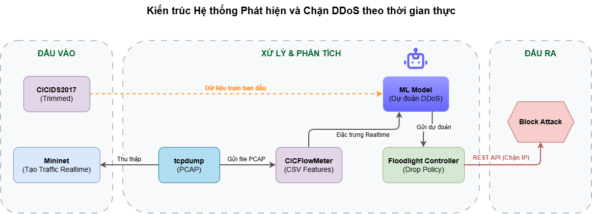

# 🛡️ DDoS Detection with SDN Floodlight + ML

Hệ thống phát hiện và chặn tấn công DDoS theo thời gian thực bằng SDN Floodlight, Mininet và Machine Learning (CICIDS2017 đã được xử lý cho phù hợp với hệ thống triển khai của đề tài) .

---

## 📚 Tổng quan hệ thống

**Kiến trúc:**



**Mục tiêu:** Quan sát và chặn tấn công DDoS tự động thông qua mô hình ML realtime.

---

## ✅ Yêu cầu trước khi chạy

### Môi trường
- **OS**: Ubuntu 22.04+ (khuyến nghị dùng VM)
- **Python**: ≥ 3.10 với `pip`
- **Java**: JDK 1.8 (cho Floodlight)
- **Quyền root**: Cần `sudo` cho tcpdump, Mininet, Wireshark

### Dependencies
- Giải nén `.venv.zip` → `.venv` (chứa tất cả thư viện cần thiết)
- Cài CICFlowMeter, build thành folder, đặt vào thư mục root của dự án
- Floodlight đã build sẵn (`.jar` file trong thư mục `target/`)

> ⚠️ **Ghi chú Windows**: Dùng WSL/VM Ubuntu để chạy. Repo chỉ hỗ trợ Linux.

---

## 🚀 Hướng dẫn chạy

**Thư mục làm việc:** `source/` - tất cả lệnh chạy từ đây
### **PHASE 1: Setup & Baseline**
---
### 1) ⚙️ Khởi động Floodlight Controller

**Terminal 1:**
```bash
sudo java -jar target/floodlight.jar
```

Kiểm tra controller đã kết nối switch:
```
http://localhost:8080/wm/core/controller/switches/json
```

---

### 2) 🧠 Huấn luyện mô hình ML

**Terminal 2:**
```bash
python3 machinelearning/ML_trainer.py --csv dataset/CICIDS2017_processed.csv
```

**Output:**
- `model.pkl` - Mô hình RandomForest đã train
- `metadata.pkl` - Features, scaler, threshold
- `model_eval_roc.png`, `model_eval_pr.png`, `model_eval_cm.png` - Biểu đồ đánh giá

> ✓ Xem các ảnh để kiểm tra AUC, PR-curve, confusion matrix trước khi tiếp tục

---

### 3) 🌐 Khởi chạy Topology Mininet

**Terminal 2 (hoặc mới):**
```bash
python3 mininet/topology.py
```

Khi Mininet CLI kích hoạt, chạy:
```
mininet> xterm h1 h2 h3
```

---

### 4) 🔗 Khởi động Hosts

Bạn sẽ có 3 xterm windows (h1, h2, h3):

**xterm h1 (Web Server):**
```bash
python3 -m http.server 80
```

**xterm h2 (Normal Traffic):**
```bash
csh mininet/ping.csh
```

**xterm h3 (Attack generator):** Để trống, chuẩn bị cho bước sau

---

### 5) 👀 Quan sát Traffic (Tuỳ chọn)

Mở Wireshark để theo dõi:
```bash
sudo wireshark
```

---

### 6) 🔥 Baseline DDoS (Không có ML)

**xterm h3:**
```bash
sh mininet/ddos.sh
```

⏱️ Chạy ~300s để quan sát traffic bình thường vs attack.
Kiểm tra Wireshark để thấy sự khác biệt rõ ràng.

---

### **PHASE 2: Realtime Detection & Blocking**

Dừng DDoS ở h3 bằng `Ctrl+C`. Chuẩn bị **3 terminal mới** để chạy song song:

#### 7a) Bắt gói tin realtime
**Terminal 3:**
```bash
./processing/capture_tcpdump.sh
```
→ Ghi PCAP vào `output/pcap_in/` (cửa sổ 15s mỗi file)

#### 7b) Chuyển đổi PCAP → CSV features
**Terminal 4:**
```bash
./processing/pcap_processor.sh
```
→ Dùng CICFlowMeter, gộp kết quả vào `output/final_csv/Predict.csv`

#### 7c) ML realtime + Blocking
**Terminal 5:**
```bash
python3 controller/realtime_floodlight_ML.py --csv output/final_csv/Predict.csv --threshold 0.07
```
→ Đọc CSV realtime, dự đoán, push flow rule chặn IP tấn công vào Floodlight

---

### 8) 🎯 Chạy DDoS với ML Active

**xterm h3:**
```bash
sh mininet/ddos.sh
```

**Kỳ vọng:**
- Terminal 5 (ML Controller) sẽ phát hiện và in: `Block src [IP]`
- Floodlight push flow rule DROP
- h1 sẽ từ chối kết nối từ h3 sau ~10-20s
- h2 vẫn bình thường (legitimate traffic)

---

## 🧱 Cấu trúc Code

| File | Vai trò |
|------|---------|
| `feature_schema.py` | Định nghĩa **80+ features** từ CICFlowMeter |
| `ML_trainer.py` | Train RandomForest + CalibratedClassifier |
| `realtime_floodlight_ML.py` | Đọc CSV realtime, dự đoán, push flow rule |
| `capture_tcpdump.sh` | Bắt PCAP theo cửa sổ thời gian (15s) |
| `pcap_processor.sh` | Chuyển PCAP → CSV features, gộp vào Predict.csv |

---

## 🔧 Khắc phục sự cố

| Vấn đề | Giải pháp |
|--------|----------|
| CICFlowMeter không chạy | Kiểm tra JAR, jnetpcap trong `processing/pcap_processor.sh` |
| `Predict.csv` không cập nhật | Xác nhận `capture_tcpdump.sh` tạo PCAP, processor đang chạy |
| Floodlight không nhận flow rule | Kiểm tra switch kết nối, DPID trong [localhost:8080](http://localhost:8080/wm/core/controller/switches/json) |
| ML không phát hiện attack | Kiểm tra threshold, `metadata.pkl` có đúng features không |

---

## 📋 Tham khảo nhanh

```bash
# ===== PHASE 1: Setup & Baseline =====

# Terminal 1
sudo java -jar target/floodlight.jar

# Terminal 2
python3 machinelearning/ML_trainer.py --csv dataset/CICIDS2017_processed.csv
python3 mininet/topology.py

# Trên Mininet
mininet> xterm h1 h2 h3

# h1
python3 -m http.server 80

# h2
csh mininet/ping.csh

# (Optional) Quan sát
sudo wireshark

# h3 - Baseline DDoS (300s)
sh mininet/ddos.sh

# ===== PHASE 2: Realtime Detection =====

# Terminal 3, 4, 5 (chạy song song)
./processing/capture_tcpdump.sh
./processing/pcap_processor.sh
python3 controller/realtime_floodlight_ML.py --csv output/final_csv/Predict.csv --threshold 0.07

# h3 - DDoS với ML active
sh mininet/ddos.sh
```

---

## 📊 Output & Kết quả

| Thư mục/File | Mô tả |
|---|---|
| `output/final_csv/Predict.csv` | CSV features realtime từ PCAP |
| `model.pkl` | Mô hình ML đã train |
| `metadata.pkl` | Feature list, scaler, threshold |
| `model_eval_*.png` | ROC, PR-curve, Confusion matrix |

---

## ✨ Tóm tắt luồng

1. **Floodlight** quản lý switch Mininet
2. **ML Trainer** học từ CICIDS2017
3. **Mininet** tạo traffic (normal + attack)
4. **tcpdump** bắt PCAP realtime
5. **CICFlowMeter** trích features
6. **ML Controller** dự đoán & gọi Floodlight API
7. **Floodlight** push DROP rule chặn attacker

---

**Chúc bạn demo thành công! 🚀**
